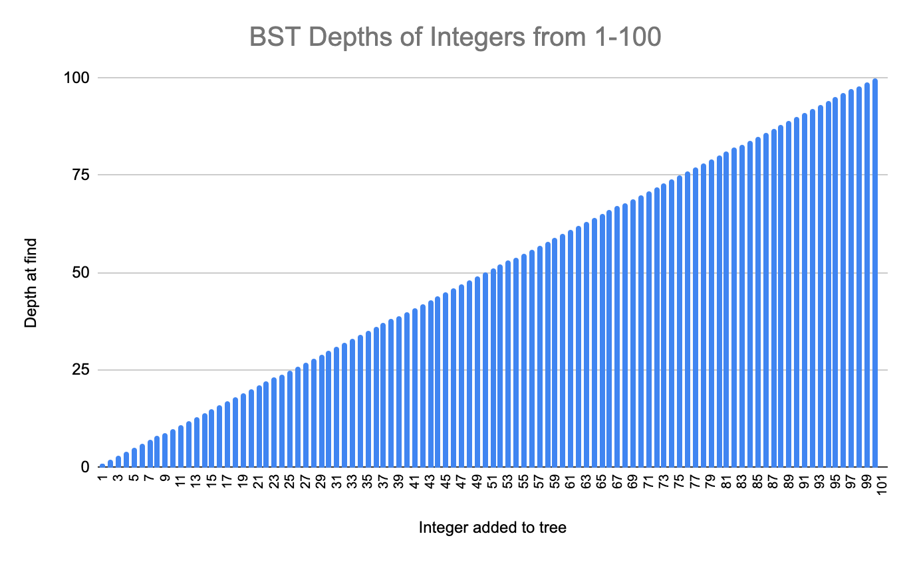
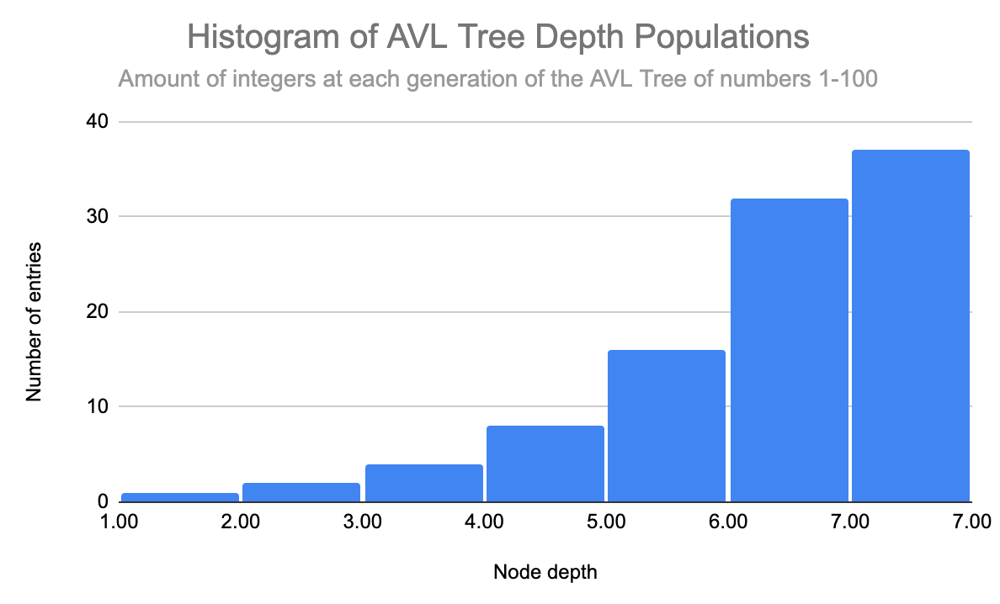
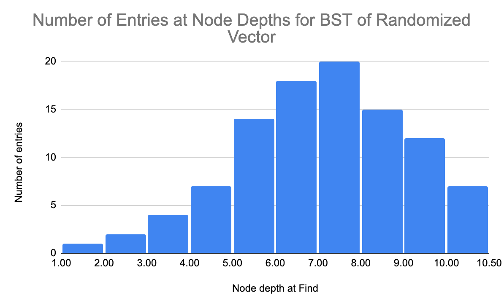
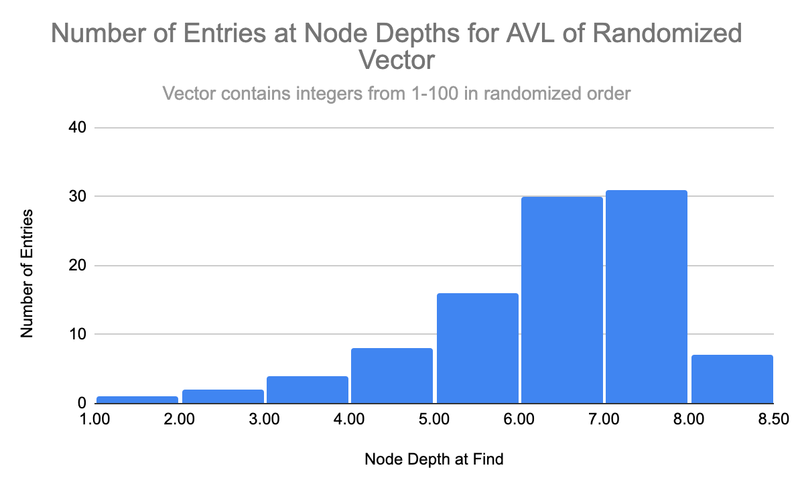
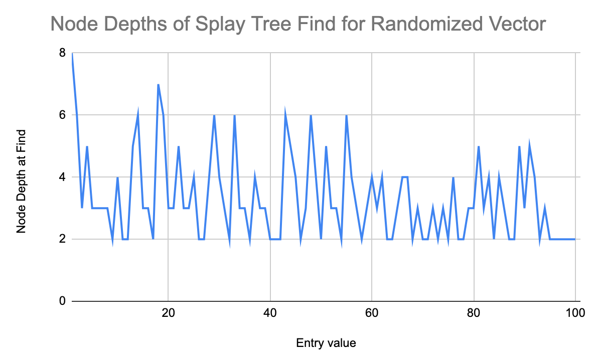
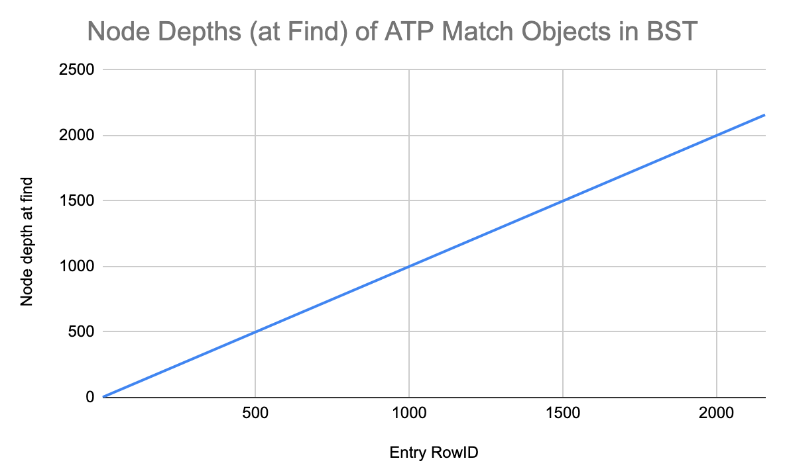
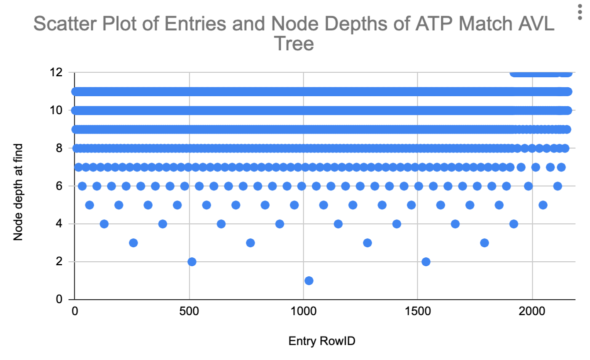
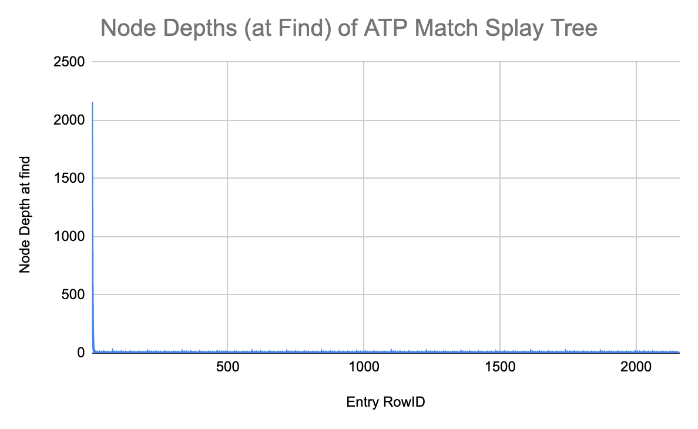

# CS 124 Project 3

Explore Binary Search trees, AVL trees, and Splay trees!

For this project, you will store your 1000+ objects in a Binary Search Tree, an AVL Tree, and a Splay Tree. You will search for objects in the tree and record how many objects you had to visit to complete the search. You will analyze your results from the different data structures.

## Setup
You will want to start at the end of Project 1. You should have a vector of 1000+ objects in your main function.
* You will need to overload the <, >, <=, >=, and == operators of your class from Project 1. Use the unique field to compare objects of your class to ensure that all objects get stored in the trees.

## Requirements

### Tree Classes
Modify the find methods of each tree class (Binary Search Tree, AVL Tree, and Splay Tree) so that a search of the tree also stores the depth of the last node visited. To do this without losing information, pass an integer by reference into both find methods and modify the integer inside the methods.
* The root node is at depth 0.
* Even if the search fails, you should still record the depth of the last node visited.

### Main Function
Create a Binary Search Tree, an AVL Tree, and a Splay Tree all of type integer. Using a loop, insert the integers from 1 to 100 in order. In a second loop, find each integer in order and record the depths to a file.
* Check for understanding: print the return values and depths you get from the BST find method if you search for 0, 101, and 102 (you should get 1, 100, and 100, respectively).

Create a Binary Search Tree, an AVL Tree, and a Splay Tree all of type integer. Using a loop, insert the integers from 1 to 100 in a random order. In a second loop, find each integer in order and record the depths to a file.
* You can get a random sequence either from random.org or by shuffling a vector of numbers (C++ has a shuffle function).

Create a Binary Search Tree, an AVL Tree, and a Splay Tree all of your custom data type. Using a loop, insert all 1000+ objects into the trees in the order they appear in your vector. In a second loop, find each custom object in the same order and record the depths to a file.

Create another Splay Tree of your custom data type. Using a loop, insert all 1000+ objects in the order they appear in your vector. In a second loop, find each object five times in a row before searching for the next object and record the depths to a file.
* You should have 5000+ depths stored in the file for this tree.
* You should have a total of 10 tree objects in main.

### Report
You must write a report about your project. Answer the following questions directly in this section of the README file:
* You will have a different grader again, so make sure your report includes information about your dataset.
  * My dataset is made up of individual ATP tennis matches from 2022, up to the US open in September. Each object contains fields for:
    a unique rowID
    the tourney date
    the tourney name
    the number of minutes played in the match
    the winner's: name, number of aces, number of 1st serves that were made in, the number of 1st serve points won, the number of break points saved, the number of break points faced.
    the loser's: name, number of aces, number of 1st serves that were made in, the number of 1st serve points won, the number of break points saved, the number of break points faced
* How do the depths of the random-ordered integers compare to the depths of the ordered integers for each tree? Why?
  * BST: For the BST of ordered integers from 1-100, each integer in the range has a depth that is equal to the integer itself.  This is because 1 is the first number added as the root, then 2 is added as a right child, 3 is added as a right child of 2, and this continues for the entirety of the set.  Because all of the integers are already ordered, there will only be additions of right children, so the BST is essentially a singly-linked list going from the root node to the most distant descendant.  For the BST from the randomly ordered vector, however, there is much more balance in the tree.  Because the root node is not the smallest value and there is less (or no) ordering in the vector, items are added to the tree in a more balanced way.  We see from the output file that the lowest depth in the ordered case is 10, so the lowest generation of the BST of the random vector is 1/10th the depth of the lowest generation of the ordered BST.  
  * AVL: The depths of the random-ordered integer AVL tree and the ordered integer AVL tree are essentially the same.  In the ordered tree, the lowest depth is 7, while in the random tree, the lowest depth is 8.  This is due to the balancing property of AVL trees.  Because AVL trees do not allow for differences in subtree depths greater than 1, AVL trees are guaranteed to be more balanced than other types of trees, which explains why both the ordered and ramdom AVL trees had similar maximal depths.
  * Splay: For the ordered splay tree, we can see that there is initially a steep decline between the first few integers and their respective node depths.  For the first entry, 1, we see that the node depth is 100.  This is because splay trees start out as a BST, but every node that is added is splayed to the root.  So when the tree is created, 1 is the furthest node from the root because it is the smallest element in the ordered BST that has 100 as a root node and all elements linked to it in a singly-linked list from 100-1, all as left children of each previous node.  As the integer values increase, however, we start to see that the splay tree achieves more balance.  This is because every element that is searched for is splayed to the root, so searching for the next value will have reduced the size of the problem because now the next value will be part of the root node's right subtree.  The randomly ordered splay tree doesn't seem to have this initial decline/leveling off shape because the tree starts off with much more balance.  Because the vector is in random order, it does not create a tree that only branches in one direction until it reaches the end of the set.  Therefore, the maximum depth of a node that can be searched is significantly smaller.  We see in the output file that the first item searched, 1, has a depth of 8, which is consequently the max depth of the entire tree.  After this splaying, depths range from 2-7, showing that the next item to be splayed is often only a few generations from the root.   
* How do the depths of each custom-data-type tree compare to each other?
  * The depths of the custom-data-type trees correlate strongly to the patters seen in the depths of the ordered integer trees from above.  Because my unique attribute in my dataset is the RowID, which is simply a ordered range from 1-the size of the set, the BST for my dataset goes in one direction from the smallest RowID to the largest RowID.  For the AVL tree, we see that the balancing property ensures that the tree is much more balanced.  From the output file, we can see that the maximal depth is 12, which makes sense mathematically since the size of my dataset is ~2158 (2^11=2048 < 2158 < 2^12 =  4096).  The splay tree for my dataset also resembled the splay tree of the ordered integer splay tree.  Because how the splaying occurs as you add elements, the first element (RowID = 0) had a depth equal to the size of the dataset.  For each of the next few elements searched, however, the depth was approximately halved until the depths mostly leveled out in the low single digits.
* Why do the depths of the second custom-data-type Splay Tree make sense?
  * Since you are searching for an element five times consecutively, after the initial splaying to the root, the next four times that element is searched it will always be at the root already, so the depth will be 1 four times in a row after the depth prior to splaying.
* Graph the Binary Search Tree, AVL Tree, and Splay Tree depths. Do not use C++ to graph, you can use whatever spreadsheet application or graphical programming language you prefer. You can use whatever graph is most readable to you (e.g. scatter plot, histogram, etc.).
  * Your graphs should have clear labels for both x and y axes.
  * An example graph spreadsheet and an example graph image have been included in the starter code.
  * 
  * 
  * NOTE: I included graphs for my random-ordered trees, but I used a time-based seed to shuffle a vector, so every time the program runs it will produce a different randomized vector.  I included the graphs just to highlight the effects of randomization on BST specifically. 
  * 
  * 
  * 
  * 
  * 
  * 
  * 
  * 
  * 
* Compare and contrast the graphs and explain the differences based on what you know about the structure and behavior of the trees. Justify the time complexity of searching the trees based on the results.
  * BST: For the three BST graphs, you can see that the ordered integer and ATPMatch trees have the same relationship between input value and the depth of the tree.  Because both of these sets are ordered, the tree branches in only one direction, so as the input increases, so does the depth of the tree.  This means that for searching in either of these trees, the complexity would be O(N) because as the size of the input increases, in the worst case, the item you're searching for is not in the tree, and you would have to traverse the entire tree and therefore every element.  The randomly-ordered BST histogram, however, shows a more balanced distribution of entries.  Because there is more balance in this tree, the complexity will decrease to be somewhere between O(N) and O(logN).  It's not a perfectly balanced tree, so it won't be O(logN), but it's more balanced than in the case of an BST of an ordered list.
  * AVL: For all three of the AVL tree graphs, we can see that due to the balancing property of AVL trees, there is a balanced distribution of elements at each depth.  We can see the balance of the AVL tree most clearly in the scatterplot of the AVL tree for the ATP Match dataset.  Particularly in the first 6 generations, we can clearly see the tree structure with the root at the lowest depth and an equal branching on both sides.  Because AVL trees are guaranteed to be strongly balanced, the complexity for searching an AVL tree will be O(logN). Searching a balanced tree is O(logN) because at each generation you only have to look at one subtree due to the BST-like organization of an AVL tree.  For the custom dataset AVL tree, the maximum depth is 12, which makes sense mathematically because my dataset contains 2158 entries.  So, because the tree is well-balanced, there will be more than 2^11 = 2048 nodes in the tree (2^11 corresponds to a depth of 12 since the root node is counted as depth 1).   
  * Splay: For the splay tree graphs of the ordered integers and the ATP Match dataset, we can see that both graphs have the splay tree shape mentioned above in which the first values have extremely large node depth values, but for each subsequent item, the node depth decreases by about half, which is then followed by a relatively level section in which variation between node depths doesn't fluctuate that much.  This means that for these two trees, the worst case for searching an element is actually the first case.  Since these trees are initially organized like a singly linked list going from the largest element in the set to the smallest, searching for the smallest element means that you have to traverse the entire tree to get to that element, so the complexity of searching would be O(N).  For the splay tree graph of the vector of random integers, however, we can see that while the maximum depth is still the smallest element searched, the maximum depth is only 8 and stays in the single digits for all subsequent searched items.  This is because the randomly-ordered vector created a much more balanced splay tree.  Therefore, the search complexity would be closer to O(logN) on average.

**Note: Any code that was not authored by yourself or the instructor must be cited in your report. This includes the use of concepts not taught in lecture.**
 * For the shuffle function on the randomized vector of integers, I used code found at https://www.techiedelight.com/shuffle-vector-cpp/
 * I found code for the "stopwatch" part of my code in which I timed insertion into different trees at: https://www.geeksforgeeks.org/measure-execution-time-function-cpp/

## Submit
You must include your source files (including the three modified tree header files, your class header file, and the main program file), your data files (including your .csv data file and all of the output depth files), your image files (including all graphs you analyze in your report), CMakeLists.txt, and your updated README.md file that contains your report to your repository. Submit to Gradescope using the GitHub repository link, double-check that all the correct files are there, and wait for the autograder to provide feedback.

## Extra Credit
To earn up to 10 extra credit points (at the grader’s discretion), you can get more thorough results. This can include:
* Setting timers to record how long it takes you to search for the objects in each data structure and analyzing the results
* Performing more experiments with the order of insertions/searches and analyzing the results
* Performing the same experiments on 100, 200, 300, …N objects and graphing the results

* I decided to measure the time it took to insert an element into ordered BST, AVL, and splay trees as well as the time it took to insert the integer 105 into random-ordered BST, AVL, and splay trees of integers from 1-100.  For the ordered case, the BST was easily the slowest, taking on average over ~3500 nanoseconds to add to the tree.  This was because in a BST of an ordered vector, the tree only branches in one direction so to add to this tree, you have to traverse all the existing nodes.  For the AVL tree of the ordered vector, inserting an element took ~2500 nanoseconds.  This is most likely due to the balancing property of AVLs and how the tree would have to be rearranged to accomodate the new element while maintaining AVL balance.  The splay tree was by far the fastest of the ordered vector trees.  Inserting into the splay tree took ~1400 nanoseconds.  The reason the splay tree was faster than the AVL tree was also most likely due to the AVL's balance requirements.  Because splay trees don't have to maintain balance like AVL trees do, they instead splay the inserted node upon insertion to the root of the tree.  For the randomly-ordered trees, the BST tree took ~700 nanoseconds to add 105, the AVL tree took ~1654 nanoseconds, and the splay tree took ~550 nanoseconds.  This shows that there is a significant improvement in insertion efficiency when a BST is more balanced.  Both the AVL tree and the splay tree insertion times were reduced by ~1000 nanoseconds, a significant improvement in time for both trees.  Interestingly, the AVL tree became by far the slowest tree to insert into, but this makes sense again because of the balancing property of this structure.  
* Additionally, I also decided to generate 10 BSTs from vectors of random integers between 1-100 and calculate their average depths.  I found that the average was ~13 nodes deep.  I then did the same procedure with AVL trees and splay trees of random order vectors.  Predictably, the AVL tree always had a max depth of 8.  This checks out mathematically because if we think about the root node containing 2^0 nodes, and each subsequent level containing 2^1, 2^2,...2^n nodes, having a depth of 8 actually means the tree has, at most 2^7 = 128 nodes (since depth numbering starts at 1).  But we know that the tree only has 100 nodes, so the number of nodes in the tree is between 2^6 = 64 and 2^7 = 128.  Therefore, we know that the 8th level of the tree is being populated and due to the balancing property of AVL trees, this is the maximum depth an AVL of integers from 1-100 can have.  The splay trees of random integers from 1-100, similarly had a height of, on average, between 8-9 nodes deep.  This, again, is due to the splaying action of splay trees, in which found nodes are splayed to the root node, thus ensuring a certain level of balance, but not to the extent of AVL trees.    

Note that if you add this logic to your code but do not analyze it in your report, it will not count towards extra credit. If you choose to complete extra credit, include an analysis in this section of your README.md file.

## Grading
The project is out of 80 points.

| Points Possible | Description of requirement |
|------------------- | ----------------------------- |
| 5 pts | Program compiles and runs. |
| 5 pts | Code style. Readable, naming style is consistent, comments where appropriate. |
| 15 pts | The three BSTs in the main function are complete and correct |
| 15 pts | The three AVL Trees in the main function are complete and correct |
| 20 pts | The four Splay Trees in the main function are complete and correct |
| 20 pts | Report: analysis of results, professional, grammatically correct, cites sources. |
