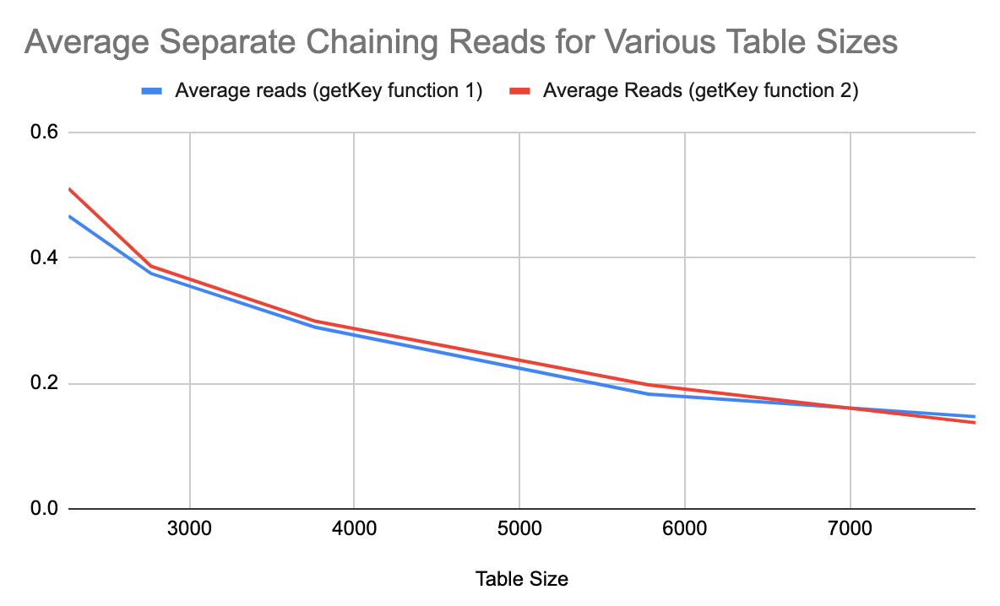

# CS 124 Project 5

For this project, you will hash the 1000+ objects from your data set. You will experiment to see what size hash table, collision detection method, and key work best for your data.

## Implement

### Setup
You will want to start at the end of Project 1. You should have a vector of 1000+ objects in your main function.
* You must use Separate Chaining.
* You must also choose any of the following open addressing methods (I recommend that you rename the LinearProbing class and modify it according to the method you chose):
  * Quadratic Probing
  * Exponential Probing
  * Double Hashing
  
  Hint: You should modify all three methods of the class (insert, find, and remove).

### Separate Chaining Class
Modify the insert method to count the number of reads of the hashed object.
* A read in this class is when you look at an item from the linked list, which appears as `*it` in the code.
  * Hint: the reads are not actually in the insert method, but in a method called from insert.

### Open Addressing Class
Modify the insert method to count the number of reads of the hashed object.
* A read in this class is when you look at one of the template objects from the table, which appears as `table[index].item` in the code.
  * Hint: the reads are not actually in the insert method, but in a method called from insert.

### Main File
You must create **two** different global functions in your main.cpp file that will be used as your getKey function in the hash tables.
* If you use the hornerHash algorithm from class, make sure your global functions take in an object of your class and return a unique string.
  * If you only have one unique field in your class, make each global function concatenate the unique field with another field.
* If you prefer, you can use a different hash function besides hornerHash. Make sure your keys are still unique for each object.

Create 10 separate-chaining hash table objects and 10 open addressing hash table objects of your custom data type.
* Half of the tables will use your first getKey function, half will use your second getKey function.
* You should use varying initial sizes for each of the five hash tables that use the same collision detection method and getKey function. 
  * The sizes should range from just bigger than the size of your data set to more than twice the size of your dataset, with at least two sizes being more than twice the size of your dataset.
  * Note that the hash table constructors will go to the next prime given the table size passed in, so you don't have to pass prime numbers to the constructors and your table sizes will always be prime.
* Using a single loop, insert all 1000+ objects into each of the 20 hash tables.
* For each object inserted in each of the 20 tables, record the number of hashed objects that were read. You should write this data out to file(s).
* For open addressing, print (cout) the size of the table after inserting all of 1000+  objects (because the table size may have changed in a rehash). You will need this info for the report.

## Extra Credit
For up to 10 points extra credit (at the grader’s discretion), you can:
* Use timers to see how long it takes you to insert/find elements in the hash tables.
* Use multiple types of open addressing and compare/analyze their read counts.
* Compare the runtimes with the time it takes to insert/find elements stored in other data structures (e.g. an unsorted vector, a sorted vector, a binary search tree, an AVL tree, a splay tree, a heap, etc.) The more structures you include, the better!

If you choose the extra credit option, clearly label the results and analysis in this section of your README.md file.

## Report
Include the following in this section of your README.md file:
* Information about your data set. You will be assigned a different grader for this project.
  * My dataset is made up of individual ATP tennis matches from 2022, up to the US open in September. Each object contains fields for: a unique rowID the tourney date the tourney name the number of minutes played in the match the winner's: name, number of aces, number of 1st serves that were made in, the number of 1st serve points won, the number of break points saved, the number of break points faced. the loser's: name, number of aces, number of 1st serves that were made in, the number of 1st serve points won, the number of break points saved, the number of break points faced. For this project, I used the rowID and winner and loser name attributes to create my getkey functions.  I created a string using the rowID concatenated with the winner name for my first function, and the for my second function I used the rowID concatenated with the loser name.
  * Clearly label the graph titles and axes.
  * 
    * In this graph, you can see that as the table size increases, the average reads are decreasing.  This is because in Separate Chaining, when there are collisions in the hash function, the objects that collide are placed into a vector.  The reads that are measured in this graph are when we check to see if the key of the item being added to the vector matches the keys of the other items.  So it makes sense that as the size of the table grows, there will be fewer collisions and therefore fewer reads of items in vectors existing at each index.  You can also see that from the two curves in the graph that the two getkey functions behaved very similarly.  Since the graph is measuring average reads for inserting the ATP Match objects into each of the hash tables, the objects being added into the hash table might collide in different ways and at different places, but are ultimately averaged out and equalized by the hash function working effectively and distributing the objects among different indices.
  * 
    * For this graph of the average reads with an Exponential Probing collision detection, you can see that there is a peculiar behavior of the graph.  I believe this has to do with the table sizes that I selected for the different Exponential Probing objects and the resizing that takes place in Open Addressing when more than half of the hash tables are filled.  For my vector of 2158 ATP Matches, I chose initial sizes of 2258, 2758, and 3258 (vector size + 100, 500, and 1000, respectively).  This means that when the ATP Match objects were being inserted into the different Exponential Probing tables, for each of these table sizes, a resizing had to have been done (since 2158 >= tableSize/2 for each table size).  So I believe the "bump" in the graph corresponds to the fact that the first three hash tables had to resize and reinsert items into the newly sized hash table, while the last two hash tables did not need to do that. 
  * You may want to graph the average number of reads per insertion, where the x-axis is the initial size of your hash table and the y-axis is the average read count. You can do this in two graphs (one for separate chaining and one for open addressing, where you'll have separate counts for each of the two getKey functions).
* Using the graphs, analyze how the number of reads change as the hash table size grows.
  * In both graphs, you can see that as table size increases, the number of reads decreases.  This makes sense for both separate chaining and open addressing.  In separate chaining, if table sizes are greater, there is a smaller chance of collisions.  For my vector of ATP Matches, since the vector size was 2158, there were more collisions (and therefore more reads) in the smaller hash tables, but as table sizes grew, there was a smaller chance of the collisions occurring.  With open addressing, since this collision detection method actually increases the size of the hash table once the number of elements that are inserted into the table surpasses the tablesize/2, it seems like for smaller table sizes, this method is a good way of mitigating collisions. However, when the table size grows past the point where the number of items being added to it (in my case from my vector of ATP Matches) can possibly exceed half of the original table size, there is a minimal difference in the average number of reads compared to separate chaining on a table of the same size.     
* Determine which getKey function works best on your dataset based on the read counts.
  * For separate chaining, it seems as though the first getkey function works better, with all but the last table size yielding lower average read numbers.  Similarly for Exponential probing, the average read numbers are in general lower for the first getkey function than the second.
* Draw conclusions about which hash collision detection method works best on your dataset (separate chaining or open addressing).
  * In general, it seems as though separate chaining works better for my dataset.  For the table sizes that I selected (which are the same between the separate chaining and exponential probing hash tables), the average number of reads were quite a bit lower.  I'm not certain as to why this is the case, but I wonder if the resizing of the first three tables in my exponential probing tests increased the read count since the old items had to be reinserted back into the resized table.  This doesn't explain why the last two tables that were not resized also had higher average read counts though.  Perhaps the hash function in separate chaining just did a better job of distributing the items in the table.

**Note: Any code that was not authored by yourself or the instructor must be cited in your report. This includes the use of concepts not taught in lecture.**

## Submit
You must include your source (all .cpp and .h) files, your data (.csv) file(s), your output file(s), CMakeLists.txt, and your updated README.md file that contains your report to your repository. Submit to Gradescope using the GitHub repository link, double-check that all the correct files are there, and wait for the autograder to provide feedback.

## Grading
The project is out of 70 points.

| Points Possible | Description of requirement                                                    |
|------------------- |-------------------------------------------------------------------------------|
| 5 pts | Program compiles and runs.                                                    |
| 5 pts | Code style. Readable, naming style is consistent, comments where appropriate. |
| 5 pts | Hashed at least 1000 objects using separate chaining.                         |
| 15 pts | Hashed at least 1000 objects using open addressing.                           |
| 5 pts | Used at least 5 different hash table sizes, as specified above.               |
| 5 pts | Used two getKey functions, as specified above.                                |
| 10 pts | Recorded the number of reads for each type of hashing.                        |
| 15 pts | Analyzed the results and wrote about everything outlined above.               |
| 5 pts | Report: professional, grammatically correct, cites sources.                   |