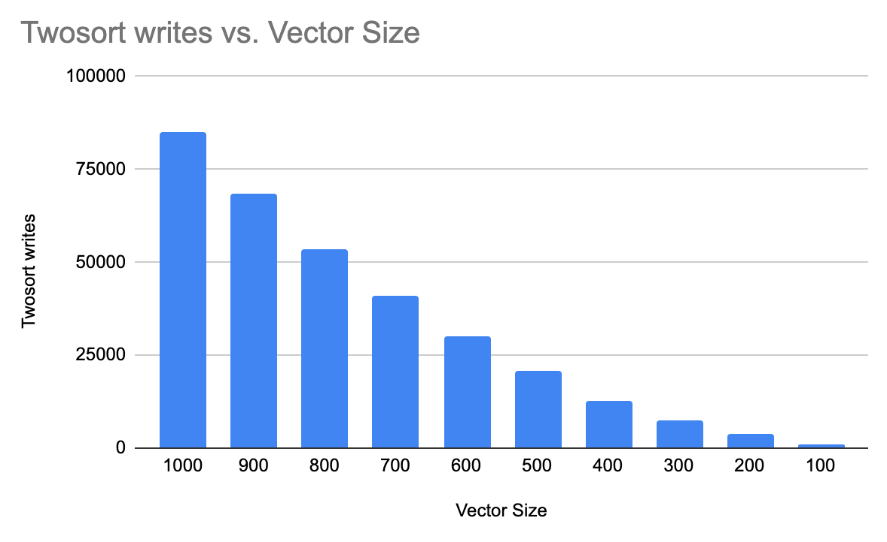

# CS 124 Project 4

For this project, you will sort the 1000 objects from your data set. You will modify each sorting algorithm to collect data. You will analyze the results from the different sorting algorithms.

## Implement
You should have your 1000+ objects stored in a vector, initially unsorted.
Use these five sorting algorithms:
1. Bubble Sort
2. Selection Sort or Insertion Sort
3. Merge Sort or Quick Sort
4. Heap Sort
5. Two-sort: sort by any algorithm (except Bubble Sort), then sort on a different field using a stable sorting algorithm (again, except Bubble Sort).
   * Hint for implementing two-sort: for the second stable algorithm, make a copy of the stable sorting function and take out the template part. That way you will be able to call a getter on your custom-type objects to compare a second field of your class.

Modify each sorting algorithm to record the number of reads. This is the number of times you use a Comparable object. This could be using it to store somewhere else, using it to compare to another object, etc. Temporary Comparable objects count towards the reads. 
* Example code:
  ```cpp
  if (vec[i] > vec[i+1]) // This counts as two reads, which should
      // be counted whether the if statements evaluates to true or false.
  Comparable temp = vec[i]; // This is one read.
  smaller.push_back(vec[i]); // This is one read.
  ```
Modify each sorting algorithm to record the number of writes. This is the number of times you assign into a Comparable object. This could be to store a temporary Comparable, to overwrite an item in a Comparable vector, to push_back onto a Comparable vector, etc.
* Example code:
  ```cpp
  Comparable temp = vec[i]; // This is one write (and one read).
  smaller.push_back(vec[i]); // This is one write (and one read).
  vec[i] = vec[i+1]; // This is one write (and one read).
  ```
Use a loop to record the number of reads and writes needed to sort a vector of size 100, 200, 300, 400, 500, 600, 700, 800, 900, and 1000.
* Hint: start with 1000 and then use the resize method to make it smaller. 

Keep all output in the console (and not files). Each of the five sorting algorithms should be given identical unsorted vectors to begin with. 
* If your data is already sorted by the attribute you use to overload your operators, change how you overload your operators.

## Extra Credit
To earn up to 10 extra credit points (at the grader’s discretion), you can get more thorough results. This can include, but is not limited to:
* Setting timers to record how long it takes you to sort the objects with each algorithm.
  * I set timers for every sorting instance in my main function.  I set the timers to measure in microseconds to accommodate the huge range of durations that the algorithms would take, knowing that bubble sorting a vector of 1000 elements would take orders of magnitude longer than quicksorting a vector of 100 elements.  In general, I found that bubble sort took by far the longest, followed by heapsort, twoSort, insertion sort, and selection sort having relatively similar run times (selection sort seemed to be generally a bit faster), and quicksort being consistenly the fastest.
* Performing the same experiment, except double the size of the data set each time (instead of having it grow linearly).
  * 
  * 
  * 
  * 
  * 
  * 
  * 
  * 
    * Performing the same experiments but doubling the size of the vector each time instead of changing the vector size at a constant rate of 100 from 100-1000 resulted in the above graphs.  We can see in the above graphs that the quadratic curves for bubble sort and insertion sort are much more pronounced, since for each sort, the size of the problem is doubling.  So if each of bubble sort and insertion sort has a time complexity of O(N^2), for each subsequent sort, N is multiplied by 2^0, 2^1, 2^2,...,2^k.  So not only does the complexity of the algorithms grow at a rate of N^2, but the size of the problem is also growing exponentially.  We can see that even for quicksort and heap sort, whose time complexities are O(N log N), the graphs are showing a more pronounced curve due to the exponential growth of the vector sizes.
* Using more sorting algorithms.
  * 
  * 
  * 
  * 
    * I also performed the same experiments using Selection sort.  the first two graphs are for vector sizes increasing by 100, while the second two are for the experiment in which vector size was doubled each time.  We know that selection sort has a time complexity of O(N^2) and this is clear from the first reads graph.  As the vector size increases, the amount of reads are increasing at an increasing rate, so the curve has a quadratic shape to it.  The writes, however, appear to be closer to linear.  This makes sense because the algorithm has to read through all of the elements of the array until it finds the smallest unsorted element and then performs a swap.  So the number of swaps cannot exceed the number of elements in the array.  In fact, based on the graph, it appears that the number of writes is approximately 3N, where N is the vector size.  This makes sense based on the algorithm because we had to use a temporary variable to store the item we were going to swap, so each swap actually involved 3 writes.  For the graphs of selection sort when the vector size was doubling, however, we can see that both curves take on a more pronounced quadratic shape (similar to the above graphs showing the other sorting algorithms behavior when vector sizes double). This is again due to the O(N^2) complexity of selection sort being compounded by the exponential growth of the vector.     

Note that if you add this logic to your code but do not analyze it in your report, it will not count towards extra credit. If you complete extra credit, analyze it in this section of your README.md file.

## Report
Include the following in this section of your README.md file:
* Information about your data set (you will be assigned a different grader for this project).
  * My dataset is made up of individual ATP tennis matches from 2022, up to the US open in September. Each object contains fields for: a unique rowID the tourney date the tourney name the number of minutes played in the match the winner's: name, number of aces, number of 1st serves that were made in, the number of 1st serve points won, the number of break points saved, the number of break points faced. the loser's: name, number of aces, number of 1st serves that were made in, the number of 1st serve points won, the number of break points saved, the number of break points faced.  The attribute that I chose to use for comparisons in the sorting algorithms was the number of minutes played in each match, since my unique attribute is the RowID, which is already ordered.
* Analyze the data. Graph the number of reads and writes for each sorting algorithm and look at how the number of reads and writes grows when the size of the data set grows. Compare and contrast the different sorting algorithms and draw conclusions about which sorting algorithms are more efficient. Discuss complexities and their effects.
  * 
  * 
    * For the Bubble Sort Reads, you can see that both show a general quadratic curve (note that the vector sizes are decreasing in this graph along the x-axis, following the logic of the program).  We know the time complexity of bubble sort is N^2, so this curve makes sense, both for the reads and the writes.  By nature of the bubble sort algorithm, elements in the array are "bubbled" up toward the back of the array if they are larger, so is the vector size increases, there will necessarily be more reads (comparisons) and more writes (swaps).  We know that bubble sort has a time complexity of O(N^2), which is confirmed by the graphs that show a quadratic relationship between the vector size and the amounts of reads and writes.
  * 
  * 
    * Similarly to Bubble sort, we see that the insertion sort graphs for reads and writes shows a quadratic relationship that is explained by Insertion Sort's O(N^2) time complexity.  We can also see by the graphs though, that the amounts of reads were much higher than the amounts of writes for each vector size.  This can be explained by the fact that insertion sort starts out by sorting the first element of the array (already sorted by the fact that it is a single element), then "removes" the next element from the array and compares it to the previously sorted section found at the beginning of the array.  So in Insertion Sort, there are more reads than writes because of the comparisons that have to be made to all of the elements in the sorted section of the array for each time you add another element to that sorted part.
  * 
  * 
    * For Quicksort, we see that the curves for reads and writes do not have the quadratic shape that the previous two sorting algorithms had.  These curves look linear, but are most likely showing the time complexity of Quicksort, which is O(N logN), which appears to be linear, but is in fact slower than linear algorithms and thus has a more steep slope than O(N).  However, O(N logN) is significantly more efficient than O(N^2).  We can see by the amount of reads and writes for the largest vector size of 1000, that compared to the numbers for Bubble sort, for example, quicksort uses significantly fewer reads and writes.  This is probably due to the recursive nature of the algorithm.  Since the algorithm breaks the vector down into smaller problems by selecting a pivot, sorting based on those pivots, partitioning the array into smaller subarrays, and recursively repeating this until the array is sorted, the algorithm doesn't need to perform a large amount of swaps, which is why the read and write numbers are so much lower than other algorithms.  
  * 
  * 
    * For the Heapsort graphs, you can see that the curves are somewhere between the shape of the quadratic curves of Insertion and Bubble sort and the more flat curve that we see in Quicksort.  We know that Merge Sort has a time complexity of O(N logN), but we can see from the data that Heapsort is only slightly more efficient in terms of reads than insertion sort and less efficient in writes than insertion sort.  My guess as to why this is the case is that Heapsort has to arrange the array into the heap ordering before it can sort the data, which will require more reads and writes on every pass through the array than quicksort, for example.  I would also guess that the graphs for heapsort are showing a O(N logN) growth rate, just with a more pronounced slope than Quicksort.  This makes sense when looking at the time that each algorithm takes to sort in my program.  For every vector size, Heapsort took significantly longer than quicksort to run.  
  * 
  * 
    * For my TwoSort algorithm, I decided to first use a selection sort on the array to sort it by minutes (like all of the other aglorithms in this project) and then used insertion sort as my stable algorithm to sort the data based on the w1stWon (ATP Match winner's number of first serves won).  We know that both selection sort and insertion sort have time complexities of O(N^2), but in my algorithm I had selection sort run to completion first and then insertion sort, so the total complexity of the twoSort algorithm is O(N^2 + N^2) or O(2N^2) or simply O(N^2) when simplified.  This is reflected in the reads/writes graphs for twoSort.  We see a similar quadratic shape to these two graphs that we saw with bubble sort and insertion sort.  Interestingly, twoSort is still more efficient than Bubble Sort, despite the fact that it involves two separate sorting algorithms performed in sequence. 
* Answers to the following questions: 
  * If you need to sort a contacts list on a mobile app, which sorting algorithm(s) would you use and why? 
    * If I were to sort a contacts list on a mobile app, I would probably use a combination of sorting algorithms like twoSort to sort the list by last name in alphabetical order.  Firstly, I would want to sort the contacts by their first name.  For this, I would use something like quicksort because stability won't be a factor for this initial pass, the names just have to be in alphabetical order.  I would then use a stable sorting algorithm like merge sort to sort the names by last name in lexicographical order.  This way, since Merge sort is stable, the previously sorted first names will retain their relative order in the event that multiple people share the same last name.  This alogirithm would consist of two algorithms with O(N log N) complexity, so their overall complexity would still be O(N log N).
  * What about if you need to sort a database of 20 million client files that are stored in a datacenter in the cloud?
    * For this, I would want to use a sorting algorithm with O(N log N) complexity since the size of the dataset is so large.  That means I would be using either quicksort, mergesort, or heapsort.  However, I would also want to consider stability and space complexity.  For stability, we could have a stable version of quicksort and merge sort, since heap sort is not stable.  Therefore, the choice would be between quicksort and merge sort.  According to the textbook (pg. 159), quicksort has a worst case time complexity of O(N^2) if a dataset is intentionally arranged in a specific way designed to run in O(N^2) time.  This can be alleviated by using a randomized dividing item selection strategy, but this would add to the runtime of the algorithm.  Therefore, merge sort might be the best option.  Also according to the textboo (pg. 159), merge sort is useful for "large arrays with unknown distribution, huge amounts of data, and parallel sorting."  So with all of this in mind, since merge sort is stable, runs in O(N log N) time, and works well with very large datasets with unknown distribution, I would say that I would use merge sort in this scenario. 

**Note: Any code that was not authored by yourself or the instructor must be cited in your report. This includes the use of concepts not taught in lecture.**

## Submit
You must include your source (all .cpp and .h) files, your data (.csv) file(s), CMakeLists.txt, and your updated README.md file that contains your report to your repository. Submit to Gradescope using the GitHub repository link, double-check that all the correct files are there, and wait for the autograder to provide feedback.

## Grading
The project is out of 90 points.

| Points Possible | Description of requirement |
|------------------- | ----------------------------- |
| 5 pts | Program compiles and runs. |
| 5 pts | Code style. Readable, naming style is consistent, comments where appropriate. |
| 5 pts | Use five sorting algorithms according to the directions above. |
| 15 pts | Sort the 100, 200, … 1000 objects according to the directions above. |
| 40 pts | Record the correct number of reads and writes for each sort. |
| 20 pts | Report: content, formatting, professional, grammatically correct, cites sources. |